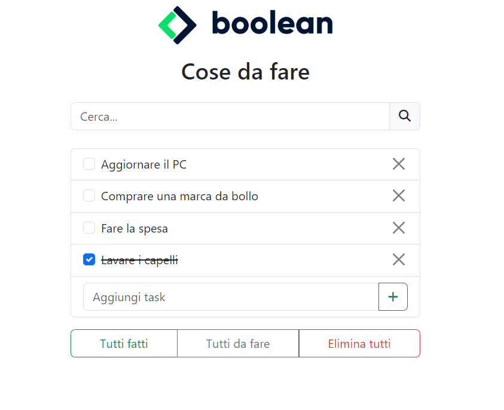

# Esercizio di oggi: `Vue To Do List`
## nome repo: **`vue-todolist`**
### **Descrizione:**
Rifare l'esercizio della to do list.
Ecco l'array di oggetti da utilizzare:
```js
[
  { id: 1, done: false, text: 'Fare la spesa' },
  { id: 2, done: true, text: 'Lavare i capelli' },
  { id: 3, done: false, text: 'Comprare una marca da bollo' },
  { id: 4, done: false, text: 'Aggiornare il PC' }
]
```
## **`MILESTONE 1`**
Stampare all'interno di una lista HTML un item per ogni todo.
Se la proprietà done è uguale a true, visualizzare il testo del todo sbarrato.
## **`MILESTONE 2`**
Visualizzare a fianco ad ogni item ha una "x": cliccando su di essa, il todo viene rimosso dalla lista.
## **`MILESTONE 3`**
Predisporre un campo di input testuale e un pulsante "aggiungi": cliccando sul pulsante, il testo digitato viene letto e utilizzato per creare un nuovo todo, che quindi viene aggiunto alla lista dei todo esistenti.
## **`Bonus:`**
1. oltre al click sul pulsante, intercettare anche il tasto ENTER per aggiungere il todo alla lista
2. cliccando sul testo dell'item, invertire il valore della proprietà done del todo corrispondente (se done era uguale a false, impostare true e viceversa) usando un checkbox
3. Mostrare una scritta "non ci sono task" se abbiamo cancellato tutti i task
## **SUPER BONUS**
Creare dei bottoni con le azioni massive (tutti fatti, tutti da fare, elimina tutti)
Creare un filtro di ricerca in tempo reale

# Traccia:

